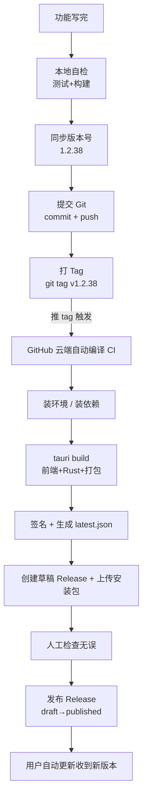

# 软件从"写完代码"到"用户下载"，中间到底发生了什么？

> 一份给纯小白看的发版科普。用 **solo 这个软件**（你正在用的 Tauri 桌面 Markdown 编辑器）当真实例子。
> 阅读约定：每一节先摆**技术长啥样**（命令 / 配置 / 文件），再给**大白话解释**。
> 想照着操作看技术真相 → 读 `RELEASE_PROCESS.md`（那是权威说明书）；本文是它的"人话翻译版"。

---

## 〇、先打个比方：整个流程像什么？

把做软件想成 **"开工厂发货"**：

| 现实世界 | 软件世界 |
|---|---|
| 设计师画好图纸、备齐零件 | 你写完了代码（Vue 界面 + Rust 引擎） |
| 出厂前质检，确认零件能拼、能跑 | 本地跑测试 + 构建（`bun run test` / `bun run build`） |
| 给产品贴型号标签「型号 1.2.38」 | 改版本号（3 个文件同步） |
| 把图纸存进公司总档案库 | 提交到 Git（`git commit` + `git push`） |
| 给这一批货拍照片、盖"发行章" | 打 Tag（`git tag v1.2.38`） |
| 云工厂按 SOP 自动组装、装盒、贴防伪 | GitHub 云端自动编译打包（CI） |
| 货先进仓库锁着，老板检查没问题再开门 | Release 从 draft 翻成 published |
| 老顾客收到"有新货"通知，上门取货 | 已装旧版的用户收到自动更新 |

一句话：**你写的代码是"图纸+零件"，编译是"按图纸组装成能跑的机器"，发布是"装盒+贴防伪+上架"，用户下载是"顾客验防伪、装回家"。**

---

## 一、全景流程图



箭头就是"先后次序"，每一步卡住，后面的都不发生。下面逐站拆开讲。

---

## 二、阶段一：本地自检 —— 出厂前质检

### 技术长啥样

```bash
bun run test     # 跑全部自动化测试，必须 0 失败
bun run build    # 等价于 vue-tsc --noEmit && vite build，类型检查 + 前端打包
```

### 大白话

你改完代码，不能"看着像对了"就发。先让电脑自己跑一遍**自动测试**（相当于质检员按清单逐项试功能），再让编译器**打包一遍界面**（相当于先试着把外壳装好，看有没有装错的地方）。

- `bun run test` = 让一群机器人替你点遍所有按钮，有任何不对就报错。
- `bun run build` = 先"类型检查"（vue-tsc），相当于核对每个零件型号对不对；再"打包"（vite），把零散的界面代码压成一个能用的前端。

**为什么要在自己电脑上先跑？** 因为本地发现错，改起来快；等推到云端工厂（CI）才发现，白白等十几分钟还浪费一次发布机会。

---

## 三、阶段二：版本号 —— 给产品贴型号

### 技术长啥样

必须同时改 **3 个地方**，且数字一模一样：

| 文件 | 字段 |
|---|---|
| `package.json` | `"version": "1.2.38"` |
| `src-tauri/Cargo.toml` | `version = "1.2.38"` |
| `src-tauri/tauri.conf.json` | `"version": "1.2.38"` |

版本号规则（语义化版本）：`主版本.次版本.修订号`
- 加新功能 → 升中间那位（1.2.8 → 1.2.9）
- 只修 bug → 升最后那位（1.2.9 → 1.2.10）
- 大改、不兼容旧版 → 升最前那位

### 大白话

就像每批货都得有个清楚的型号。**三个文件必须写同一个号**，因为这三个文件分别管"前端界面""Rust 引擎""打包配置"，少改一个，最后出厂的盒子上的型号就会印错，导致后面自动更新认不出新版本（这是 solo 真实踩过的坑）。

版本号不是随便起的数字，它告诉用户"这次是大升级还是小修补"。

---

## 四、阶段三：提交到 Git —— 存进总档案库

### 技术长啥样

```bash
git add -A
git commit -m "bump version to 1.2.38"
git push origin master
```

### 大白话

Git 是个"带时间机器的档案柜"。每一次 `commit` 就是给当前所有代码拍一张**永不可改的快照**，`push` 是把快照上传到 GitHub 这个公共柜子，队友（和你自己）随时能翻回去看。

为什么要先存？因为后面云端工厂是从这个柜子里"取图纸"来组装的。你没 push，云工厂拿到的就是旧图纸。

---

## 五、阶段四：打 Tag —— 给这一版盖"发行章"

### 技术长啥样

```bash
git tag v1.2.38
git push origin v1.2.38
```

### 大白话

分支（如 `master`）是**会一直往前走**的——你明天还会往里加新代码。但"要发给用户的这一版"必须是**固定不动**的。

`tag` 就是给某次提交贴一张**永不移动**的标签，名字叫 `v1.2.38`。它像给这批货拍了张定妆照：以后不管 master 怎么变，这张照片永远指向"发版那一刻的代码"。

**关键**：标签名 `v1.2.38` 必须和上面三个文件的版本号**一字不差**。因为下一步云端工厂就是靠"推上来一个 `v` 开头的标签"来判断"啊，要发版了！"

---

## 六、阶段五：CI 自动编译打包 —— 云工厂按 SOP 开工

这是最"黑盒"的一步，也是你每次等十几分钟的源头。

### 6.1 是什么触发了它？

`release.yml` 里写着一句话：

```yaml
on:
  push:
    tags: ["v*"]
```

意思是：**只要有人推上来一个以 `v` 开头的标签，就自动开工。** 你上一节的 `git push origin v1.2.38` 就是那个扳机。

> 大白话：你不在厂里，但你在厂门口贴了张 SOP（配方文件 `release.yml`）。每当"发行章"送进来，云服务器就雇一台临时电脑，严格按 SOP 一步步做。这台电脑用完即毁，不占你本机。

### 6.2 云工厂具体干了啥？

```text
1. 取图纸        checkout 代码
2. 装工具        装 Node.js 22 + Bun + Rust（像工厂先领机床）
3. 装零件        bun install（把界面要用的第三方库下载齐）
4. 开编译        bun run tauri build --target x86_64-pc-windows-msvc
   ├─ vue-tsc    界面类型检查
   ├─ vite build 界面打包成网页文件
   ├─ cargo build Rust 引擎编译成机器码（最慢，10~15 分钟）
   └─ makensis   把成品塞进 Windows 安装盒（.exe 向导）
5. 写 changelog  从 git log 抽出这次改了啥
6. 签名          给安装包盖防伪章 + 生成 .sig
7. 生成 latest.json  更新公告牌
8. 建草稿 Release + 上传 .exe / .sig / latest.json
```

逐项大白话：

- **装环境 / 装依赖**：工厂先领机床、买齐螺丝。云电脑是空白的，啥都没有，得现装。
- **`tauri build`（核心）**：Tauri 把"前端网页界面"和"Rust 后台引擎"**揉成一个真正的桌面程序**。
  - `vue-tsc` + `vite build` = 把 Vue 写的界面检查并压成 html/js/css（网页文件）。
  - `cargo build --release` = 把 Rust 写的引擎编译成电脑能直接跑的机器码。`--release` 是"优化成品模式"（跑得快、体积省，但编译慢）。
  - `makensis` = 用 NSIS 工具把程序+资源打成一个 **Windows 安装向导 `.exe`**（双击→下一步→装好）。类比：把机器、说明书、螺丝刀装进一个带引导的盒子。
- **changelog**：自动从 Git 历史里摘出"这次相对上一版改了哪些提交"，作为给用户看的"本次更新了啥"。
- **签名 / latest.json / 草稿 Release**：这三件是自动更新的命脉，单独在第七节讲。

> 耗时参考：Rust 编译首次约 10~15 分钟（云电脑没缓存），之后有缓存约 3~5 分钟。所以你每次发版干等，主要是在等 Rust 这台"重型机床"慢慢加工。

---

## 七、三个"小零件"讲透（你最该懂的）

### 7.1 签名 `.sig` + 公钥：防伪章

**技术长啥样**

```powershell
# CI 里：用私钥给安装包签名，吐出一行签名
bunx tauri signer sign solo_1.2.38_x64-setup.exe
# 生成 solo_1.2.38_x64-setup.sig
```

`tauri.conf.json` 里写着对应的**公钥**：

```json
"updater": {
  "pubkey": "dW50cnVzdGVkIGNvbW1lbnQ6IG1pbmlzaWduIHB1YmxpYyBrZXk6...",
  "endpoints": ["https://github.com/jloft198479-cyber/solo/releases/latest/download/latest.json"]
}
```

**大白话**：网上下载的东西，谁都能偷偷换成带病毒的。所以厂家用一把**只有自己有的私钥**给安装包"盖个防伪章"（`.sig` 文件）。你的软件里**预装了配对的公钥**（那段 `pubkey`），装新版本前先用公钥验一下："章对得上吗？"对得上才装，对不上立刻拒绝。

- 私钥 = 厂家保险柜里的印章（存在 GitHub 密匙里，绝不公开）。
- 公钥 = 发到每个用户手里的"验章器"（公开无害，只能验不能造假）。
- 没有这步，坏人就能伪装成官方更新，往你电脑里塞木马。

### 7.2 `latest.json`：货架门口的电子公告牌

**技术长啥样**

```json
{
  "version": "1.2.38",
  "notes": "修复了 Mermaid 黑屏等问题",
  "pub_date": "2026-08-13T05:16:04Z",
  "platforms": {
    "windows-x86_64": {
      "url": "https://github.com/jloft198479-cyber/solo/releases/download/v1.2.38/solo_1.2.38_x64-setup.exe",
      "signature": "dW50cnVzdGVk..."
    }
  }
}
```

**大白话**：这是一块固定在网上的小公告牌，永远只有一句话："**最新版是 1.2.38，下载地址在这，防伪章是这串**"。

你的软件每次启动，派个小弟去这块公告牌看一眼：发现 `1.2.38` 比你自己装的 `1.2.37` 新 → 弹窗"有新版本，要不要更新？"。用户一点，就按 `url` 去下载、按 `signature` 验章、装好重启。

所以 `latest.json` 写错版本号（比如还写着旧版），用户就**永远收不到更新**——这是 solo 真实踩过的坑。

### 7.3 draft vs published：货先进仓锁着，确认无误再开门

**技术长啥样**

```bash
gh release edit v1.2.38 --draft=false   # 把草稿翻成正式发布
```

**大白话**：CI 打完包，创建的是 **draft（草稿）状态的 Release**——只有你能看见，用户和自动更新器都"看不到"。

为什么要留草稿？因为 CI 只是"按 SOP 把活干完"，它**不替你判断这版有没有问题**。留成草稿，等于"货先锁在仓库里"，你上去检查：安装包在不在、型号对不对、三件套齐不齐，确认 OK 了，再手动 `draft=false` 把门打开。

**这一步不翻，用户收不到任何更新**——更新器只认"正式发布"的 Release，草稿对它等于不存在。

---

## 八、阶段六 & 七：开门 + 用户收货

- **你这边**：跑 `gh release edit v1.2.38 --draft=false`，货架开门。
- **用户那边**：已装旧版 solo 的人，下次启动（或手动"检查更新"）时，小弟读到 `latest.json` 发现新版 → 弹窗 → 下载（带 `.sig` 验章）→ 安装 → 重启。全自动，用户只需点"更新"。

你最后还要在 `CHANGELOG.md` 顶部补一条版本记录（"这版改了啥"），方便日后回看。

---

## 九、最容易"翻车"的几点（大白话版）

| 现象 | 人话原因 | 怎么避 |
|---|---|---|
| 云工厂报错 `replaceAll is not a function` | 用了太新的写法，老浏览器/老环境不认 | 发版前搜一遍有没有 `replaceAll`，有就换成老写法 |
| 找不到安装包 `No installer found` | 工厂找盒子的路径写错了 | 路径要用变量，别写死（已修在 `release.yml`） |
| 用户收不到更新 | 要么忘了翻 `draft=false`，要么 `latest.json` 版本写错 | 发布后务必确认三件套 + 版本号一致 |
| 等了 25 分钟还没好 | 云电脑没缓存，从头编译 Rust 很慢 | 正常，首次就这速度；超 25 分再查 |
| 推 tag 被拒 `already exists` | 之前同名标签没清干净 | 先删远程再删本地，重新打 |

---

## 十、一页速查（你每次发版照着勾）

```text
[ ] 本地测试 + 构建全过        bun run test && bun run build
[ ] 三个文件版本号一致改好       package.json / Cargo.toml / tauri.conf.json
[ ] 提交并推送                  git commit + git push
[ ] 打 tag 并推送               git tag v1.2.38 && git push origin v1.2.38
[ ] 等 CI 跑完（~15 分钟）      看 GitHub Actions 状态变绿
[ ] 检查 Release 三件套齐全      .exe / .sig / latest.json
[ ] 开门发布                    gh release edit v1.2.38 --draft=false
[ ] 旧版上实测自动更新能收到
[ ] 补 CHANGELOG 版本记录
```

---

## 十一、想知道每一步的"标准操作原文"看哪

- 权威技术说明书：[`RELEASE_PROCESS.md`](./RELEASE_PROCESS.md)（精确命令、故障排查全在这）
- 发版总纲（含"先想清楚再动手"的前半段）：[`docs/PLAYBOOK.md`](./PLAYBOOK.md)
- 云端工厂的配方：[`.github/workflows/release.yml`](../.github/workflows/release.yml)
- 更新器/签名配置：`src-tauri/tauri.conf.json` 的 `plugins.updater`

本文只负责"让你看懂"，真要照做请以这几份为准。
